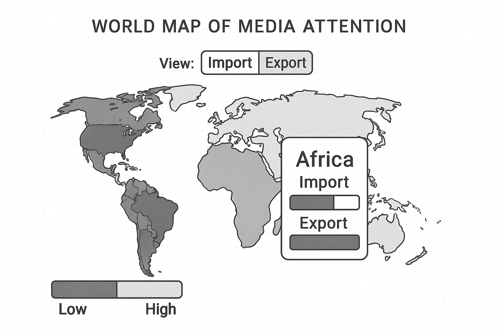
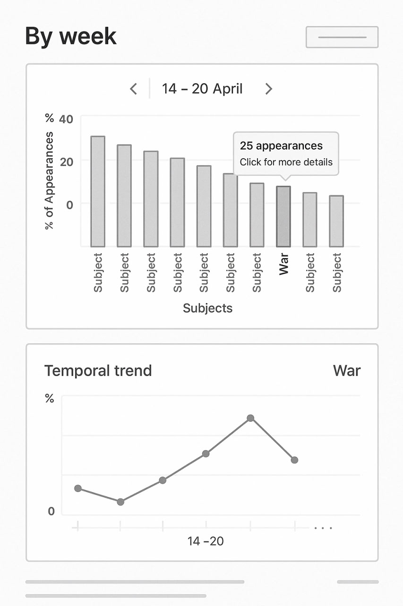

# **NewsMaster**
# Milestone 2

## Project Goal

We aim to make global news trends instantly understandable through intuitive and interactive visualizations. Our project helps users see:

- Who's talking about whom (country-to-country media attention),
- What's being talked about (keyword/topic clusters), and
- When it's trending (temporal evolution of attention and topics).

The result will be a live dashboard showing the most discussed countries, topics, and their interconnections. This serves users who want to stay updated on global narratives at a glance.

---

## Visualizations

### 1) World Map of Media Attention

#### Description & sketch:
- **Import view**: How often a country is mentioned in *other countries'* news.
- **Export view**: How often a country's *media talks about* other countries.
- **Interactions**: 
    - Hover for a view breakdown
    - Switch button to switch between import/export view

#### Tools & lectures needed:  
**Tools**:  
- D3.js  
- TopoJSON  
- Leaflet (maybe)  

**Lectures**:  
- 4_2_D3
- 5_1_Interaction

### 2) Keyword Bubble Chart

- **Node**: a named entity or keyword
    - *size*: number of articles where the keyword occurs
- **Edges**: co-occurence in the same article
    - *thickness*: number of co-occurrences

#### Tools & lectures needed
**Tools**:
- D3.js
- Plotly.js 
- Chart.js

**Lectures**:
- 4_2_D3

### 3) Temporal Trend Rankings

- **View**: Ranking of top 10 topics over past in a week. Shown as a histogram of the % of occurence of the topic in the articles of the selected week, ordered.
- **Interactions**:
  - Hover a bar displays the total number of appearances
  - Click a bar displays a new graph, showing the trending of this topics over the weeks

#### Tools & lectures needed
**Tools**:
- D3.js
- Plotly.js 
- Chart.js

**Lectures**:
- 4_2_D3.pdf
- 5_1_Interaction

## Roadmap
### ML

- [ ] Parse RSS feeds Action, clean them (TODO add link)
- [ ] Apply NLP (Named Entity Recognition, Trend)
- [ ] Docs to explain the model and choice of hyperparameter
- [ ] Docs to explain the dataset format
  
### Website development

- [X] Website deployment via git action
- [ ] Page design and layout
- [ ] Add graph libraries and try them out
- [ ] Design the graphs with dummy data
- [ ] Link the dataset with the graphs

---
The images of this document have been produced with the help of OpenAI tools.
